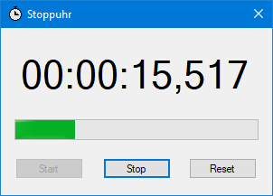

### Stoppuhr

Einfacher Zeitnehmer. Bedienbar per Maus oder mit der Leertaste.

 * Framework: dotNET 4.0
 * Solution für SharpDevelop 5.2.1

Was noch schön wäre, ist ein Worker-Thread, der die Anzeige laufend aktualisiert. Bisher nur mit Timer...
